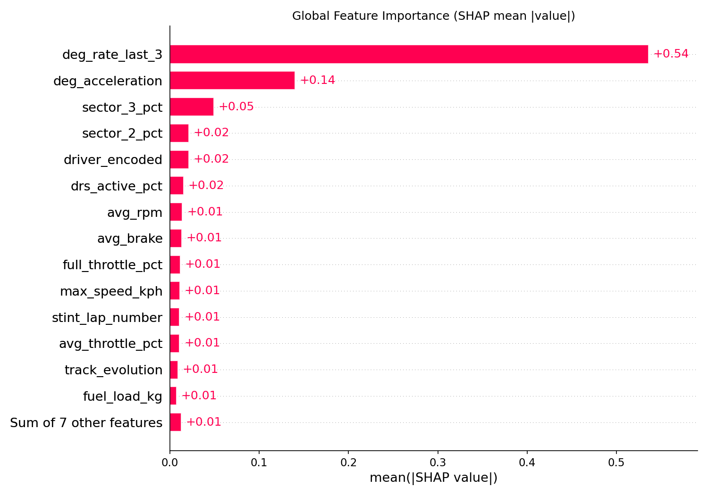
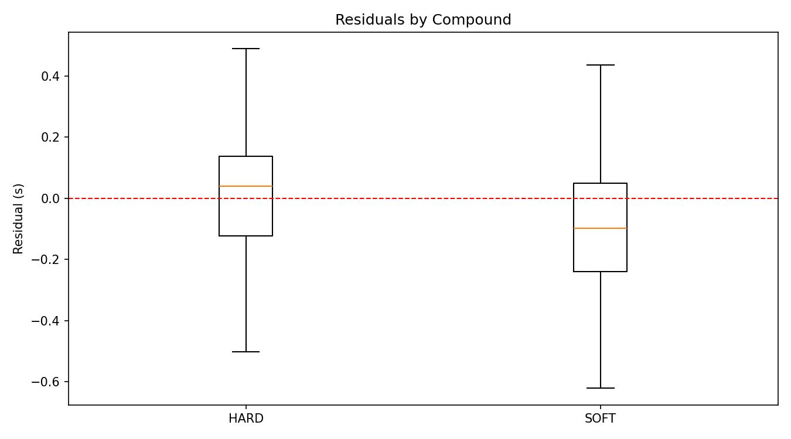
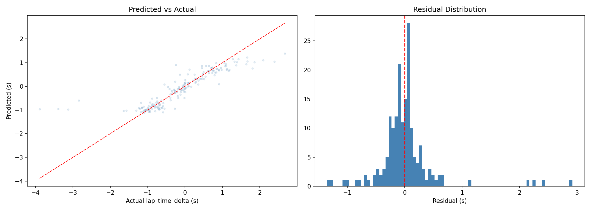

# Formula One Tyre Degradation Model

Predicts per-lap tyre degradation in F1 races using LightGBM trained on FastF1 telemetry data (2023–2025).

## What it does

- **Target:** `lap_time_delta_fuel_corrected` — how many seconds slower each lap is vs the first clean lap of a stint, after removing the ~0.066 s/lap fuel weight effect
- **45% MAE improvement** over a linear baseline (test MAE: 0.268s, R²: 0.746)
- **19 features** covering tyre compound, stint position, driving style telemetry (throttle, braking, DRS, RPM), weather, and track evolution
- **50-trial Optuna hyperparameter search** with LightGBM Huber loss
- **SHAP explainability** — global feature importance, waterfall plots, residuals by compound
- **FastAPI dashboard** — live predictions, data explorer, diagnostic plots

## Pipeline

```
make ingest      # pull lap data via FastF1 API → parquet (2023–2025)
make telemetry   # per-driver telemetry aggregation (4 workers)
make features    # fuel correction, stint deltas, rolling deg features
make train       # 50-trial Optuna sweep → model.lgb + SHAP plots
make serve       # start dashboard at http://localhost:8000
```

Or run the full demo:
```
python demo.py
```

## Results

| Split | MAE | RMSE | R² |
|---|---|---|---|
| Validation (2025 R1–10) | 0.138s | 0.238s | 0.886 |
| Test (2025 R11+) | 0.268s | 0.486s | 0.746 |
| Baseline (linear) | 0.491s | 0.673s | 0.086 |

## Key design decisions

- **Strict temporal split** — 2023–24 trains, 2025 R1-10 tunes Optuna, 2025 R11+ is held-out test. No data leakage.
- **No driver identity features** — `driver_encoded` was dropped deliberately. The model predicts tyre physics, not "Verstappen is fast."
- **Huber loss** — robust to outlier laps that slipped through cleaning.
- **Fuel correction** — 0.035 s/kg lap time adjustment applied before computing degradation delta.

## Diagnostic plots



Oh look a boxplot.


## Setup

```bash
python -m venv .venv
.venv/bin/pip install -e .
```

Requires Python 3.11+. Data is not committed — run `make ingest` to fetch from FastF1.
