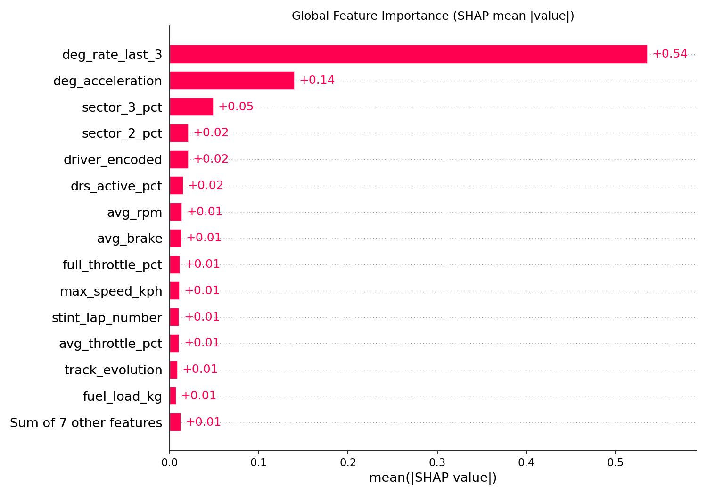
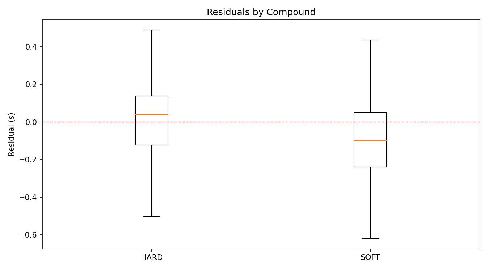
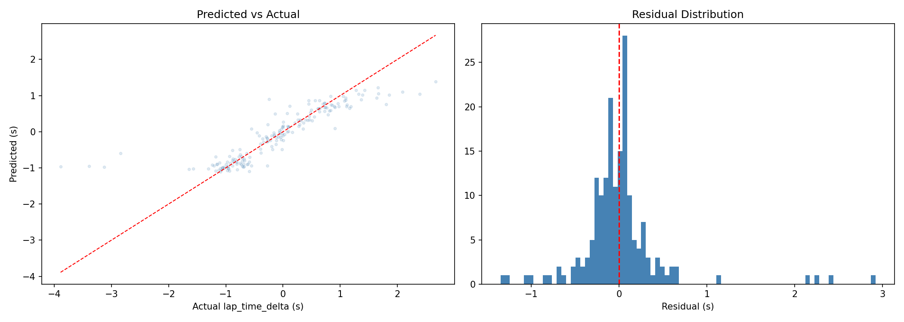

# Formula One Tyre Degradation — Telemetry Core & Prediction Model

Real-time F1 CAN bus telemetry processor in C++ feeding a LightGBM degradation model trained on FastF1 data (2023–2025).

## Architecture

```
[C++ CAN Bus Simulator]
  mock tyre thermal arrays (4 tyres × 3 zones), fluid dynamics, kinematics @ 100Hz
        ↓
[Lock-free SPSC Ring Buffer]  ←  mmap-backed, zero-copy slot writes
        ↓
[Priority-driven RTOS Scheduler]
  HIGH  — interrupt handler: parse CAN frame → ring buffer push
  MED   — feature aggregator: thermal avg, fluid deltas
  LOW   — MQTT publisher: serialize lap struct → broker
        ↓
[Mosquitto MQTT]  →  [Python bridge]  →  [FastAPI / LightGBM]  →  degradation Δ (seconds)
```

## C++ Embedded Layer

| Component | File | Description |
|---|---|---|
| CAN frame types | `embedded/include/can_frame.hpp` | CAN 2.0B structs, thermal matrix, fluid dynamics |
| Ring buffer | `embedded/include/ring_buffer.hpp` | Templated SPSC, `mmap(MAP_ANONYMOUS)`, `std::atomic` head/tail |
| Task scheduler | `embedded/include/task_scheduler.hpp` | Priority queue + thread pool + WCET tracking |
| CAN simulator | `embedded/src/can_simulator.cpp` | Mock F1 telemetry frames at configurable Hz |
| RTOS main | `embedded/src/rtos_scheduler.cpp` | Wires simulator → scheduler → MQTT |
| WCET benchmark | `embedded/src/benchmark.cpp` | Baseline vs. ring-buffer-decoupled latency measurement |
| MQTT bridge | `embedded/scripts/mqtt_consumer.py` | MQTT → POST `/predict` → prints lap delta |

### WCET benchmark results

Measures interrupt-handler worst-case execution time: single-threaded (parse + aggregate + MQTT) vs. ring-buffer-decoupled (parse only, I/O deferred to LOW task).

```
BASELINE    p50= 131µs   p95= 137µs   p99= 142µs   worst= 171µs
SCHEDULED   p50=  63µs   p95=  73µs   p99=  75µs   worst= 132µs

WCET improvement (p99): ~47%
```

## ML Model

- **Target:** `lap_time_delta_fuel_corrected` — seconds slower per lap vs. first clean stint lap, fuel-corrected
- **47% MAE improvement** over linear baseline (test MAE: 0.268s, R²: 0.746)
- **19 features** — compound, stint position, telemetry (throttle, braking, DRS, RPM), weather, track evolution
- **50-trial Optuna sweep** with LightGBM Huber loss
- **SHAP explainability** — feature importance, waterfall plots, residuals by compound

### Model results

| Split | MAE | RMSE | R² |
|---|---|---|---|
| Validation (2025 R1–10) | 0.138s | 0.238s | 0.886 |
| Test (2025 R11+) | 0.268s | 0.486s | 0.746 |
| Baseline (linear) | 0.491s | 0.673s | 0.086 |

## Running

### C++ embedded core

```bash
# Dependencies (macOS)
brew install cmake mosquitto cjson

# Build
make embedded

# WCET benchmark (~5s)
make bench

# Live telemetry daemon (publishes to MQTT)
brew services start mosquitto
./embedded/build/rtos_scheduler
```

### ML pipeline

```bash
make ingest      # FastF1 API → parquet (2023–2025)
make telemetry   # per-driver telemetry aggregation (4 workers)
make features    # fuel correction, stint deltas, rolling features
make train       # Optuna sweep → model.lgb + SHAP plots
make serve       # dashboard at http://localhost:8000
```

### Full end-to-end (MQTT → prediction)

```bash
# Terminal 1
make serve

# Terminal 2
./embedded/build/rtos_scheduler

# Terminal 3
make mqtt-bridge
# [LAP  3 | SOFT        ] tyre=94.2°C → Δlap = +0.38s
```

## Key design decisions

- **Strict temporal split** — 2023–24 trains, 2025 R1–10 tunes Optuna, 2025 R11+ held-out test. No leakage.
- **No driver identity features** — model predicts tyre physics, not driver skill.
- **Huber loss** — robust to outlier laps that slipped through cleaning.
- **Ring buffer over mutex queue** — SPSC avoids contention on the interrupt-handler critical path.
- **MQTT decoupling** — zero-copy serialization layer separates high-frequency CAN parsing from network I/O.

## Diagnostic plots



Oh look a boxplot.


## Setup

```bash
python -m venv .venv
.venv/bin/pip install -e .
```

Requires Python 3.11+. Data is not committed — run `make ingest` to fetch from FastF1.
